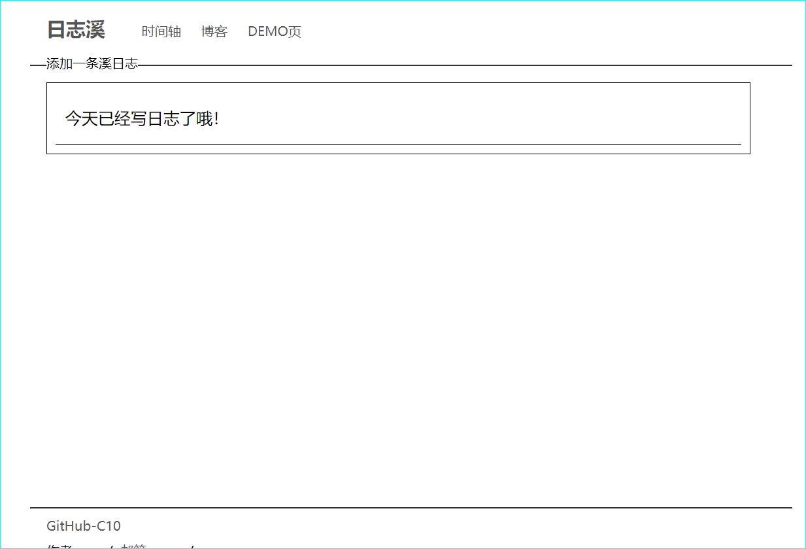

# 每日日志记录

> 在即刻上发现碰到杰克老哥发布的一个c10程序，有感而发，做个一句话日记。

观望地址：[@杰克有茶lv5](https://web.okjike.com/originalPost/62811652e8693e9b8ba255cb)

## 程序界面

首页：

时间轴：

判断逻辑：

一天只能存储一条，如果当天已经留言，则会提醒

## 使用技术

前端html，后端使用php接口传递数据，数据库使用leancloud。

使用的插件：

| 名称       | 作用               |
| ---------- | ------------------ |
| wangeditor | 简洁的富文本编辑器 |
| axios      | 数据请求           |
| qs         | 数据序列化         |
| smoke      | 美化的消息提醒     |

## 规划与期待

想要做一个微信小程序版本的，因为网页端并没有考虑移动端的UI，兼容性不强。

预计在2个月内有时间的时候在去搞。

毕竟，还得生活。

数据安全性校验没做，急于完成功能了，但不碍事。
